**Last Updated:** April 2019

# Building Chatbots with Amazon Lex

## Overview

Amazon Lex is a service for building conversational interfaces into any application using voice and text. Amazon Lex provides the advanced deep learning functionalities of automatic speech recognition (ASR) for converting speech to text, and natural language understanding (NLU) to recognize the intent of the text, to enable you to build applications with highly engaging user experiences and lifelike conversational interactions. With Amazon Lex, the same deep learning technologies that power Amazon Alexa are now available to any developer, enabling you to quickly and easily build sophisticated, natural language, conversational bots (&quot;chatbots&quot;). This lab is designed to demonstrate how to create a new bot including defining intents and slots. This lab will walk you through the following:

- Creating a Lex bot
- Adding intents
- Adding slot types
- Using AWS Lambda as the back-end logic for Lex

# Step 1: Create the bot

1. Log in to the [AWS console](https://console.aws.amazon.com/lex/home) and navigate to the Amazon Lex service
2. **Please ensure you have selected North Virginia as the region in the top right (Amazon Connect is not available in all regions yet)**
3. If you have never created a bot, click &quot;Get Started&quot;
4. Choose &quot;Custom bot&quot;, which will display a dialog asking you to defined your bot
5. Our bot name will be &quot;PersonalBanker&quot;
6. Choose your preferred output voice
7. Session timeout should be 5 minute
8. Choose &quot;No&quot; to the Children&#39;s Online Privacy Protection Act (COPPA) question

The form should now look as follows, noting that we&#39;re going to accept the default IAM role.

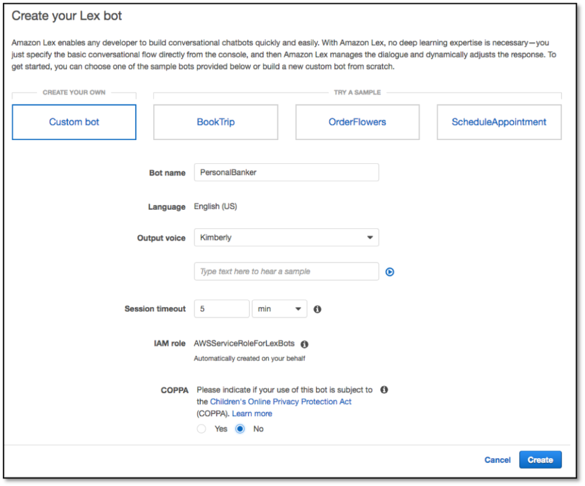

8. Click &quot;Create&quot;
9. We will start by creating an intent, which represents an action that the user wants to perform. For example, we&#39;re going to create one intent in this lab for &quot;Get Balance Check&quot; ;  (If you have time afterwards you can create a separate intent for getting last transaction) Click the &quot;Create Intent&quot; button.
10. In the window that pops-up click the &quot;Create intent&quot; link

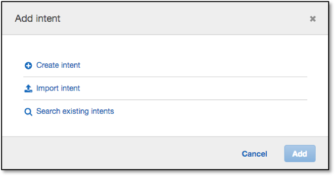

11. Our first intent enables the user to get account details, so name this intent &quot;GetBalanceCheck&quot; then click &quot;Add&quot;.

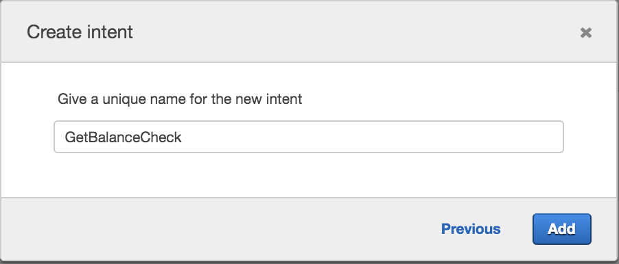

12. We now want to provide samples of what our user would type or say to perform this action (i.e. to activate this intent). Under &quot;Sample utterances&quot;, type the below phrases and hit [enter] or click the blue &quot;+&quot; sign after each phrase. Make sure you do not add a question mark at the end of the phrase as this will cause build issues later on.

- _Check my bank balance_
- _how much money is in my account_
- _how much money do i have_


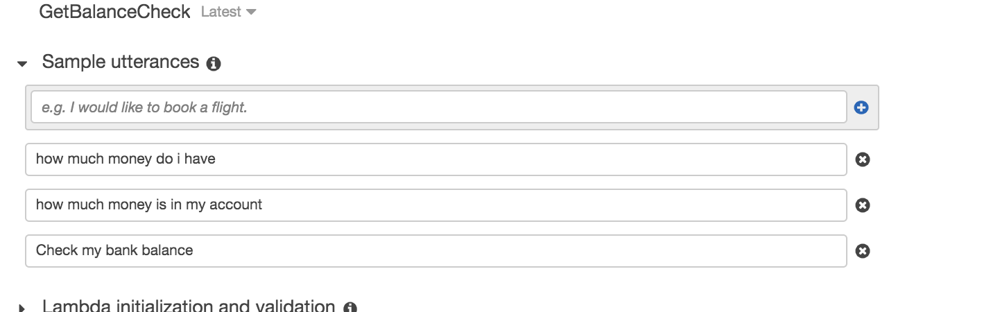

13.  Next we define a slot which is information we need to process the users request. This information can be included in the utterance (query) that the user types or says, and if not included, Lex will prompt the user for the information. While Lex includes many built-in slot types (such as number, colour, city, food, etc), in this case we want to define a custom slot to get the account type that the user is referring to.

Click on the blue &quot;+&quot; sign next to &quot;Slot types&quot; on the left hand side of the screen and select the &quot;Create slot type&quot; link - note, "Slot types" is initially greyed out, and on some laptop screens may not be obvious
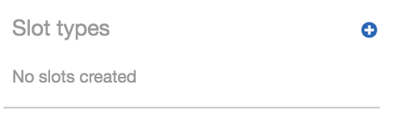

14. Click create slot type
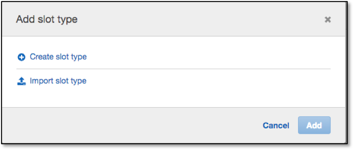

14. For &#39;Slot type name&#39; enter &quot;AccountType&quot; and optionally enter a description (although description is not required)
    
15. Select restrict to Slot values and Synonyms
 
16. For Value, we want to allow the user to make queries against either their &quot;Saving&quot; or &quot;Current&quot; account so enter those as values, clicking the blue &quot;+&quot; sign after each word.

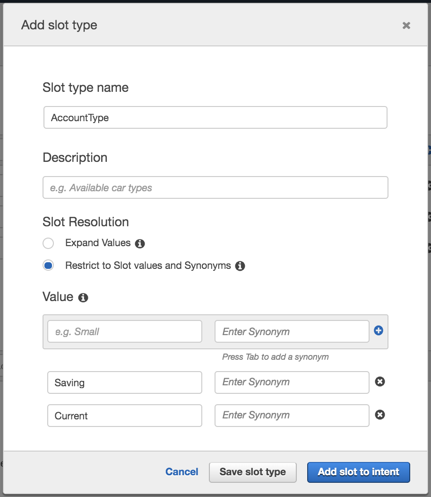

16. Click &quot;Add slot to intent&quot;
17. We now have to link the slot types to the Intent with additional information such as whether it is required or not and the prompt to use (ie how Lex will ask?) Enter 'What type of account do you have (current or saving?)'.

	In the existing Slot list change the &quot;Name&quot; field from &quot;slotOne&quot; to &quot;AccountType&quot; so that it matches the slot name that we specified when we created the sample utterences.

18. Specify &quot;What type of account do you want to check (Current or Savings)?&quot; for the &quot;Prompt&quot; field. This prompt will be used by our bot if the user does not specify an account type when asking a question.

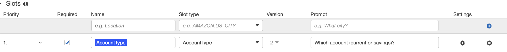

19.  We are now going to ask a security follow up question and ask the user to enter their four digit pin number.

Add another slot and add the name as &quot;PinNumber&quot;.  Select the slot type AMAZON.FOUR_DIGIT_NUMBER and add the prompt as &quot;what is your pin number for your {AccountType} account&quot;. Ensure you click on the plus icon to add your new slot.

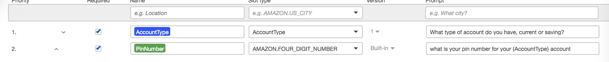

It is worth noting as you build other intents you can modify the order of the Slot collection (ie what questions get asked in which order) and also whether or not the slot is "Required" before passing the values to our external function.

1.  Scroll down and click &quot;Save Intent&quot;

If at any point you made a mistake in the steps above, selecting the &quot;Latest&quot; version of the intent at the top, next to the intent name, will allow you to edit your choices.

21. Let&#39;s build this simple Bot: Hit the grey Build button at the top right corner. You will be asked for confirmation to build. Click &quot;Build&quot;.

The build process takes approximately a minute. Once complete, you can ask your bot a question as a way to test it. For example, you could type &quot;what is my balance
?&quot; in the chat window, or click the microphone symbol, speak your request and client it again to have Lex translate your speech to text. At this stage since we have not added in the backend Lambda function, the response will be that the bot is ready for fulfillment and will show you the values which will be transferred.
<a name="testingthebot">

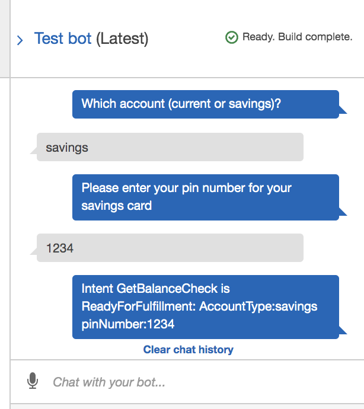.</a>

22.  It is possible to give the user a simpler interface on the bot to multiple choice questions using Response Cards. If you click on the small cog icon next to the "AccountType" slot you get the option to add a "Prompt response card". Add a title "Select your card type" and add button title Saving Account (choose value Saving) and Current Account (value Current). Click &quot;Save&quot; and rebuild and test. You will now be presented with a multiple choice option select.

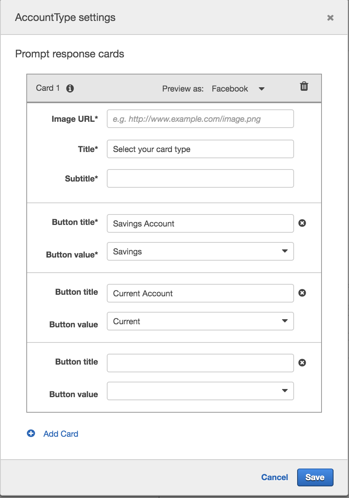

# Step 2: Fullfilling the bot

We are now in a position that we can transfer the answers to the 'slots' over to a function to perform logic and get a result for the user.

Here we will create a Lambda function that has some Javascript code to detect the intent name (&#39;GetBalanceCheck&#39; and return values based on the AccountType and if the Pin number was entered correctly.

In the Lambda function we have hard-coded an Array of data but in a real world example we would have authenticated the user and would use a database lookup for the account balances.

1. Use the AWS Console to navigate to Lambda.
2. Click on the orange &#39;Create a function&#39; link under the &#39;Getting Started&#39; section
3. On the &quot;Create function&quot; page, click the &quot;Author from scratch&quot; button
4. Let&#39;s give our function the name of &quot;myPersonalBanker&quot; and optionally provide a description
5. Choose Node.js 8.10 as the Runtime
6. We will &quot;Create new role from template – give it a Lex-style role name (such as &quot;LexRole&quot;) and select &quot;Test Harness permissions&quot; as the policy template.


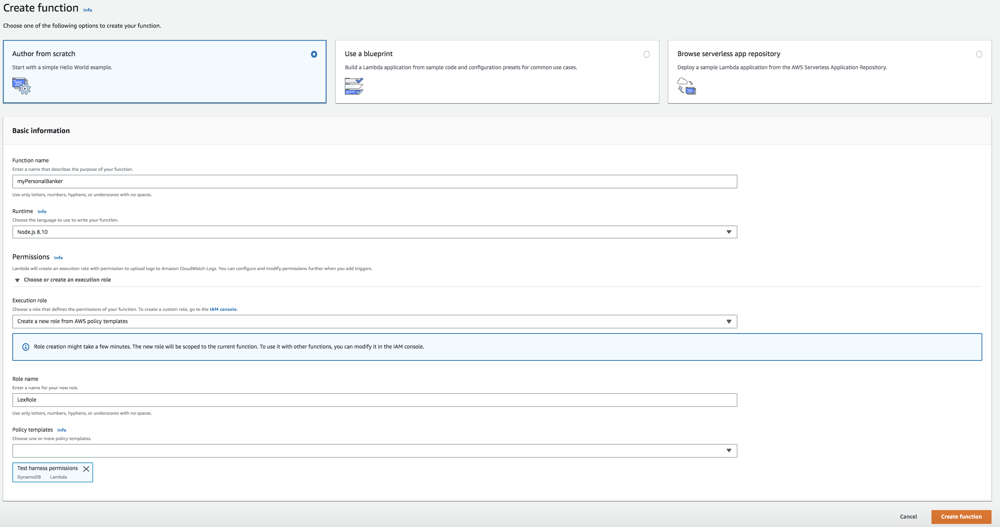

1. Hit &quot;Create function&quot; on the bottom right and you&#39;ll be take to the &quot;Configuration&quot; window.  We are not adding any additional triggers, nor are we using Lambda Layers, so scroll down to the &quot;Function code&quot; section
2. Open the lambda function code you will find [here](./myPersonalBanker_v1.js) (myPersonalBanker\_v1.js). Copy and paste the code into the inline editor – make sure that you overwrite any template code that is already in the code box
3. Scroll down to the &#39;&quot;Execution role&quot; section and ensure that the role you created previously is selected in the &quot;Existing role&quot; drop-down – if not then please select it
4.  Leave the rest unchanged, then hit the orange &quot;Save&quot; button at the top of the screen

# Step 3: Link the bot with the Lambda function

In this step we will link the three intents we created to the Lambda function. We do this by providing the Lambda function as the method that contains the business logic used to &#39;fulfill&#39; the users requests. Once this is done (and the bot rebuilt), when a user specifies an intent (such as &#39;what is my checking account balance&#39;), Lex will call our Lambda function and pass it the intent name (&#39;GetAccountDetail&#39;) and the slot value (&#39;checking&#39;).

To do this, we go back to the [Lex Console](https://console.aws.amazon.com/lex).

1. Click on Personal Banker
2. Enure the &#39;GetBalanceCheck&#39; intent is selected
3. Make sure that the &#39;Latest&#39; version is selected for both the bot and the intent

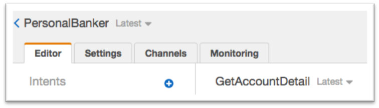

4. Scroll down to &quot;Fulfillment&quot;, select &quot;AWS Lambda function&quot;, choose &quot;myPersonalBanker&quot; and click &quot;OK&quot; in the popup warning window which opens. It indicates you are giving Lex the permission to run this Lambda function.

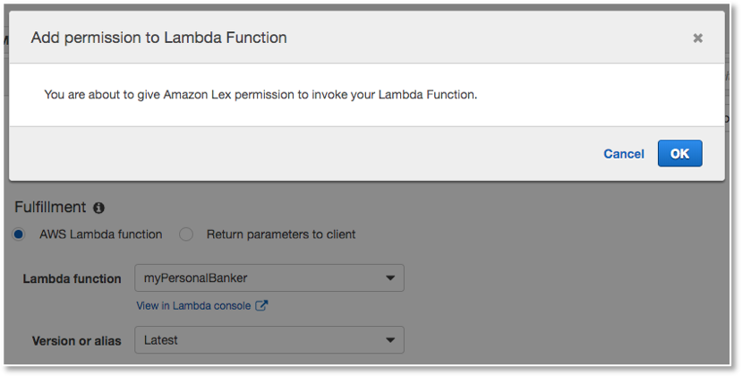

5. Click &quot;Save intent&quot;
6. Repeat the above steps **3, 4 and 5** for intents &quot;GetLoanDetail&quot; and &quot;GetLoanProducts&quot;
7. Click &quot;Build&quot; and then click &quot;Build&quot; again on the confirmation screen.

# Step 4: Running and debugging the bot

1. If you now test the bot as you did at the bottom of [Step 1](#testingthebot) you will see a sample response back from the lambda function. This function has been setup to show you how a very basic flow can be configured and over the next few steps we will modify the code to make the function more helpful.

The function 'closes' the Lex box with a message displaying the values passed into the slot. If you look within the Javascript for the function named 'simpleResponse' you should be able to see it does very little other than return data back to the user.

2. To make the application more useful we want to pass values into the function and retrieve data back from a data source (in this case an array but in production this could be a database). 

If you modify the lambda function and look for the line **'return simpleResponse(intentRequest, callback);'** and place '//' before this line and remove the '//' from the line below so it looks like:

``` javascript
    //return simpleResponse(intentRequest, callback);
    return balanceIntentError(intentRequest, callback);
    //return balanceIntent(intentRequest, callback);
```

Save your lambda function and retry the Lex bot. First off all try by choosing 'Saving' and saying the 'PinNumber' is 1234. You should now get a nice response from lex telling you of your account balance. However, at the moment your Lex box will error if you enter an incorrect PinNumber which is not helpful to the user. 
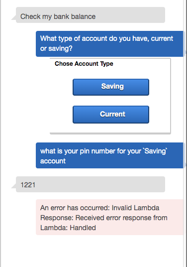

3. Finally we are going to add some error handling and a feedback loop to the user until a correct PinNumber is entered. The code will check to see if there is an account match and if not will request the user tries again and resets the 'Slot'.

If you modify the lambda function and look for the line **'return balanceIntentError(intentRequest, callback);'** and place '//' before this line and remove the '//' from the line below so it looks like:

``` javascript
    //return simpleResponse(intentRequest, callback);
    //return balanceIntentError(intentRequest, callback);
    return balanceIntent(intentRequest, callback);
```
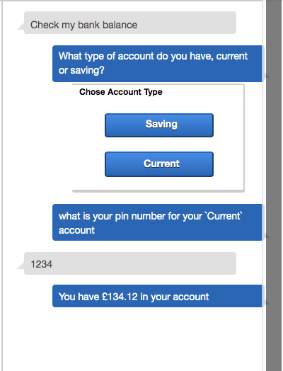
# Conclusion

In this lab you have learned the basic operations to manage a Lex bot. First, you created a bot, then you defined intents and slot types. Finally you defined a Lambda function and attached it to your chatbot.

**NOTE We will be continuing on from this Lab in the second Lab so please do not delete the Lex Bot you have created in this exercise.**
