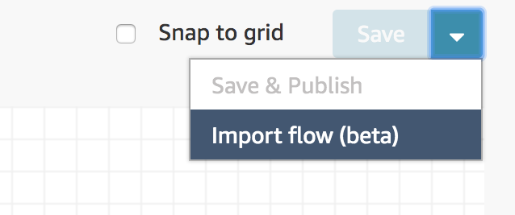
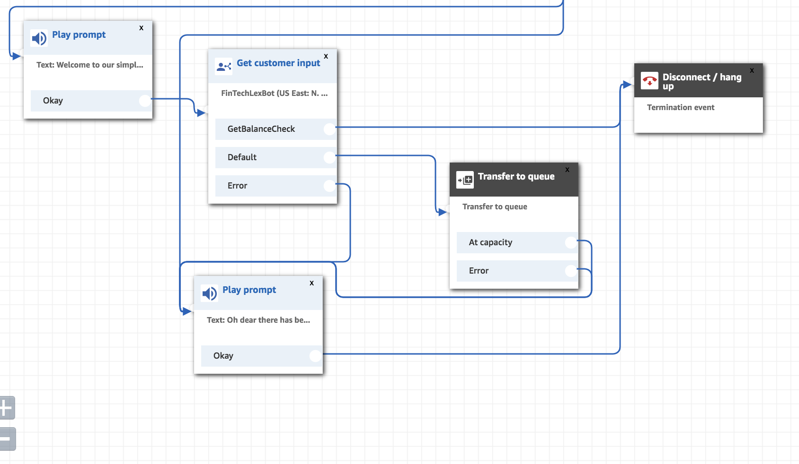

**Last Updated:** April 2019

# Building a Call Center with Amazon Connect

## Overview

Amazon Connect is a cloud-based contact center solution which makes it easy to set up and manage a customer contact center and provide reliable customer engagement at any scale. You can deploy a contact center in just a few steps, onboard agents from anywhere, and begin to engage with your customers. 

- Creating a Call Center
- Create a simple workflow
- Adding a Lex Bot to your workflow
- Improving your Call Flows
- Extra: Getting personal with your caller

# Step 1: Setting Up A Call Center

1.  Log in to the [AWS console](https://console.aws.amazon.com/connect/home?region=us-east-1#) and navigate to the Amazon Connect service
2. **Please ensure you have selected North Virginia as the region in the top right (Amazon Connect is not available in all regions yet)**
3. If you have never created a Call Center, click "Get Started"
4. Enter a custom Access URL (This is a unique name so you will might need to be creative) then click 'Next Step'
5. For this lab we will be using the default Admin account - so you can chose to "Skip" the Administrator account. Then click 'Next Step'
6. For this lab you will not need to make Outbound calls, uncheck this option and click 'Next Step'
7. The Connect application will automatically create you a S3 bucket and encrypt the data. Click 'Next Step'
8. Finally click 'Create Instance'. 

11. This may take a minute or two to setup.
12. Once it is setup you will be presented with a screen which allows you to 'Get Started'
13. Your browser will pop up a warning to ask you show notifications - this is to allow the Connect Application to notify you when a call is coming in. Click allow on the pop up.


14. At this point your Call Center is setup but you don't have any numbers so you need to 'Claim your first number' - For this lab chose a **UK Direct Dial Number** and click 'Next'.
15.  This is the first number for your call center - you now can call the number and go through the default first call example that is part of Amazon Connect by ringing the number that is allocated to you or click 'Skip for now'.

# Step 2: Create a simple workflow

Amazon Connect is based around creating workflows, these are highly customisable and in this step we will create a very simple workflow to help demonstrate how to setup a call. The flow will welcome the customer and then place them in the queue for an agent

1. When you create a new Connect environment you are presented with a "default workflow" which you can find by clicking on the 'Routing' option then 'Contact Flows' 


and then looking at 'Sample inbound flow (first call experience)'. There is a LOT going on in this workflow so we are going to create our own 'Simple flow'.


3. We are going to import a pre made 'Simple workflow'. First of all download the following zip file and extract it on your computer [Simple Workflow](https://s3-eu-west-1.amazonaws.com/connect-lex-lab/Workflows.zip).
4.  Head back to the 'Contact Flows' section listed above and in the top right click on 'Create contact flow'.
5. In the top right click on the down arrow next to the "Save" button and click Import Flow (beta).


5. Browse and find the file labelled Simple Workflow 
6. Once the workflow is uploaded you will see the following Work Flow:
   

   Let's take a moment to understand what is going on with this flow. The top line of the flow diagram is configuring the flow. You can chose which Amazon voice you want the dialogue prompts to have, we have enabled call recordings to go to our S3 buckets and said that all calls will go to the default queue that is set up when you create a call center.

   On the second line we create a message to say to the customer dialing in: 
```
   Welcome to our simple call center - thanks for calling, we are just transferring you to an agent please wait.
```

This is completely customisable and you can even record your own audio prompt.  Following this we transfer the caller to the queue ready for an advisor.

   The other items in the flow relate to what happen when an error occurs and also the end of the call.

1. The Contact Flow is complete and we need to Publish it   by clicking on the arrow next to save and choosing 'Save & Publish'
   


1. The flow is now created but it is not linked to the telephone number we created earlier. In order to associate the flow - chose 'Phone Numbers' from the Routing menu
   


9. Click on the number and you will be presented with an Edit screen - choose Simple Workflow in the Contact flow / IVR section and click Save. 


10.  Wait a few seconds and then call your phone number again and see how the flow has changed. Maybe modify the text in the Play Prompt section of the flow and Republish and call in again and see how it changes?
11.   If you want to act as a Call Agent you need to click on the phone icon in the top right of the screen and ensure you are set to 'Available'
    


# Step 3: Adding your lex bot into the flow.

We are now going to leverage the Lex Bot you built in Lab 1 within your contact flow. 

1. First of all we need to give Amazon Connect permission to access your lex bot. Head to [AWS Console](https://console.aws.amazon.com/connect/home) page for your connect app and chose your Connect instance.
   
2. Click on Contact flows and in the Amazon Lex section you can chose the Lex Bot you created earlier (ensure you click  + Add Lex Bot link)


3. We are now going to modify the simple workflow to integrate your Lex bot. On the left hand menu chose "Interact" and drag "Get Customer Input" into your workflow. 
   
   

4. If you click on the top line of the box you have dragged in you will be presented with the following option on the right hand side of your screen:
   
   

Within this edit window we are going to add a starting question (to introduce the bot) - click on 'Text to speech' and enter some text into the box below (eg "How can we help you today?").

Chose Amazon Lex and select your Lex Bot from the drop down list. 

Finally you need to add the "Intents" you wish to allow flows from - add the intent "GetBalanceCheck" (this is the Intent we created in lab 1).

5. We now need to adjust the Simple workflow to introduce our Lex bot. First of all you need to remove the link between the Play Prompt and Transfer to queue. You can remove a link by hovering over the arrow and clicking on the red cross. 
   

6. Once the link has been removed we need to introduce our recently created Input. Click and hold on the circle on the Okay within Play prompt and join it to our new box. When a connection is successfully made there will be a yellow circle at the end of the block
    

7. We now have the input flow but we need to connect the output of the Input. If you join the "Default" option to the "Transfer to Queue" block and the other two options to "Disconnect / Hang Up". 
   
8. At this point if you click 'Save & Publish' and then try redialing your number you will be presented with a new option. If you respond to the question "How can we help you today?" with the phrase "I'd like to check my balance" you will now enter your Lex bot flow you built in Lab 1.

# Step 4: Improving your Call flows

In the above example after introducing the Lex bot our customer is now actually unable to speak to an advisor as they can only get the balance of their account. 

In order to create a flow back to an advisor we need to go back to edit the Lex bot we created in Lab 1 and create a new Intent that listens for "Speak to an advisor" 

1. Head back to the Lex bot you created in Lab 1 [AWS console](https://console.aws.amazon.com/lex/home). Click on the + symbol next to Intents and add a new intent called "Advisor"
 .

2. Add the following utterances: 
   
 -  _advisor_
 -  _talk_
 -  _talk to someone_
 -  _talk to advisor_
  
  These are all phrases which the user might say in order to invoke the Call Center Advisor (feel free to add any others you can think of). 

3. We are also going to add the utterance:
   
- _one_

   Adding this utterance will allow the customer to engage with our Lex Bot via the keypad as well (ie we can tell the customer to say "Speak to Advisor or Press 1 on the keypad")

Your utterences should now look like this:


4. Click 'Build' at the top.
5. At this point we should also modify the GetBalanceCheck Intent to also add the utterance:


  - _two_ 
  
  for the same reason as above.

6. Now we need to add the intent to our Connect Workflow. Head to your workflow and click on Get Customer Input Flow. Click on "Add another intent" and type Advisor.


   

7. Having added an additional Intent this is now added to the Workflow.
   


You will want to join the arrow from the "Advisor" intent into the transfer to queue flow option.


   
8. Click Save & publish and recall your contact center. You can now either ask for an advisor (or press 1) on your keypad or continue on with the Lex flow you built earlier by selecting 2.

# Step 5: Interacting with your user based on their dialer number

When a customer calls Amazon Connect the service has access to the caller number so it is possible to build  functionality to  personally greet the user when they dial in using Lambda. This section is slightly less guided as it extends on a lot of the topics already covered.

1. Create a new Lambda function named "myPersonalResponder" 
2. Open the lambda function code you will find [here](./myPersonalResponder_v1.js) (myPersonalResponder\_v1.js). Copy and paste the code into the inline editor – make sure that you overwrite any template code that is already in the code box and save. At the top of the file is a 
3.  Within the Connect Admin (where you added your Lex bot) you can also attach Lambda functions. You will need to modify your workflow to add your new Lambda. 
   

4. Head to your workflow and Click Integrate from the left hand menu and  drag "Invoke AWS function"
 


 and add the lambda function to the workflow:

 

5. Review the Advanced_Workflow by Importing it as a new Flow, in this workflow we add following steps to the Flow:
   1. Invoke our AWS Lambda function
   2. The Lambda function returns an Object in which we define whether there is a CustomerMatch (CustomerMatch = 0/1)
   3. If there is a Customer Match: 
      1. We branch off and Set a Contract Attribute to equal the Customer Name returned from the Lambda function
      2. We play a different prompt to the user which is personalised and uses the variable we return
   4. If there is No customer match we simply respond with the original welcome message.
6. Replicate this flow in the Simple Workflow you have been using during this lab to add this functionality.


